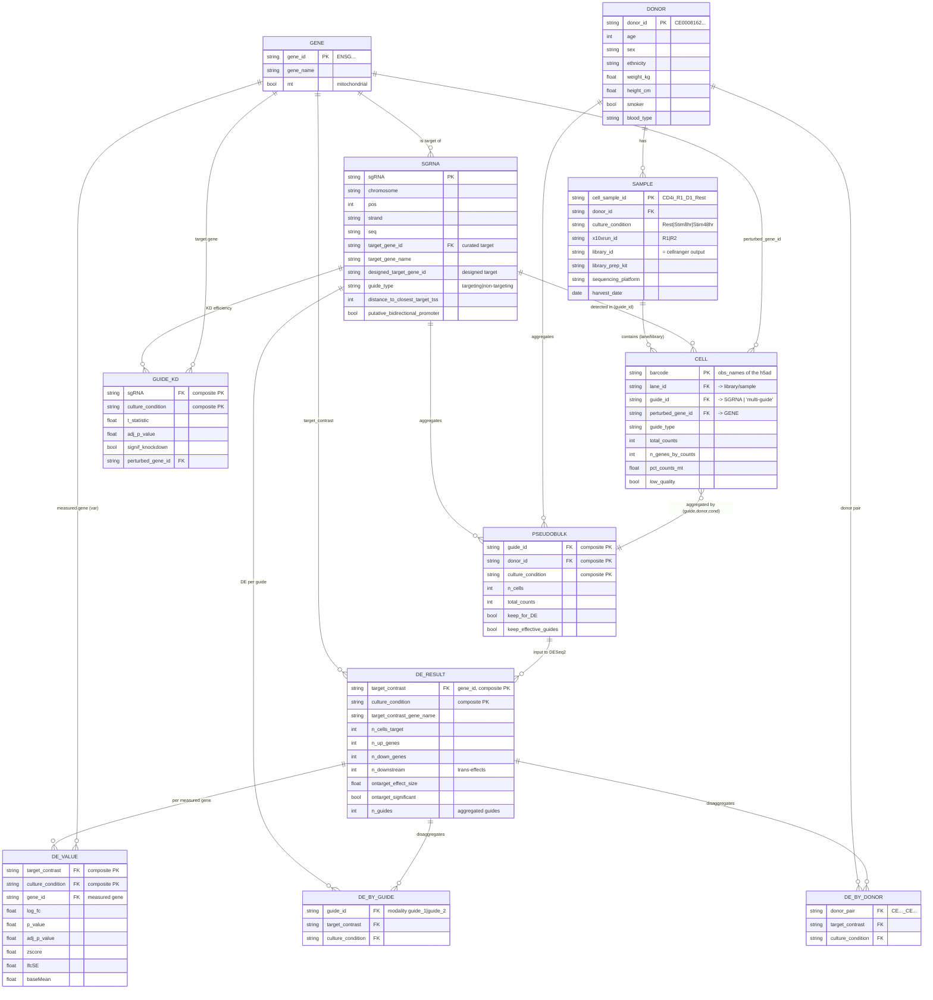

# Data model — Genome-scale CD4+ T cell Perturb-seq (Marson 2025)

The dataset is a **star schema** whose axis is the triple
**(sgRNA guide → perturbed gene) × culture condition × donor**.
Expression is aggregated in a cascade: **cell → pseudobulk → DE statistics**.

## ER diagram

## Entities and their physical origin

| Entity | File(s) | Grain (1 row =) |
|---|---|---|
| **DONOR** | `sample_metadata.suppl_table.csv` (denormalized) | one donor (4) |
| **SAMPLE** | `sample_metadata.suppl_table.csv` | donor × condition × run (11) |
| **GENE** | `.var` of any h5ad (reference) | one measured gene (~18k–36k) |
| **SGRNA** | `sgrna_library_metadata.suppl_table.csv` | one guide (31,109) |
| **CELL** | `D*_*.assigned_guide.h5ad` `.obs` | one cell |
| **PSEUDOBULK** | `GWCD4i.pseudobulk_merged.h5ad` `.obs` | guide × donor × condition |
| **DE_RESULT** | `GWCD4i.DE_stats.h5ad` `.obs` / `DE_stats.suppl_table.csv` | perturbed gene × condition (33,983) |
| **DE_VALUE** | `GWCD4i.DE_stats.h5ad` `.layers` | (perturbation×condition) × measured gene |
| **DE_BY_GUIDE** | `GWCD4i.DE_stats.by_guide.h5mu` | guide × condition |
| **DE_BY_DONOR** | `GWCD4i.DE_stats.by_donors.h5mu` | donor-pair × perturbation × condition |
| **GUIDE_KD** | `guide_kd_efficiency.suppl_table.csv` | guide × condition |

## Keys and main joins

- **Gene** is the central reference entity (`gene_id` = Ensembl `ENSG…`, `gene_name` = symbol).
  It appears in two roles: *perturbed gene* (the guide's target) and *measured gene* (a column of the expression matrix / `.var`).
- **SGRNA.target_gene_id → GENE.gene_id**: each guide points to a gene (note: `designed_target_gene_id`
  may differ from `target_gene_id` due to post-hoc curation; there are ~1–2 guides per gene).
- **CELL.guide_id → SGRNA.sgRNA** (special value `multi-guide` if more than one guide was detected).
  **CELL.lane_id → SAMPLE** (one 10x lane = one cellranger output = one library).
- **PSEUDOBULK** = aggregation of CELL by the composite key `(guide_id, donor_id, culture_condition)`.
- **DE_RESULT** = aggregation by `(target_contrast = gene_id, culture_condition)`; it joins the gene's `n_guides` guides.
  `DE_stats.suppl_table.csv` is exactly the `.obs` of this object in tabular form.
- **DE_VALUE** (in `.layers`: `log_fc`, `zscore`, `adj_p_value`, …) is the N:N relation between
  **DE_RESULT** (obs) and **GENE** (var): for each perturbation×condition, a vector over the measured genes.
- **DE_BY_GUIDE** and **DE_BY_DONOR** are the same structure as DE_RESULT but disaggregated
  (by individual guide, or by donor pair) — they feed the reproducibility metrics
  (`guide_correlation_*`, `donor_correlation_*`) that live in `DE_RESULT.obs`.

### Note on donor IDs
The short labels `D1..D4` (cell-level file names) resolve to the canonical `donor_id`
`CE…` via `sample_metadata` (`cell_sample_id` encodes `run_D#_condition`).
The modalities of `DE_stats.by_donors.h5mu` use the `CE…` IDs joined by `_`.
