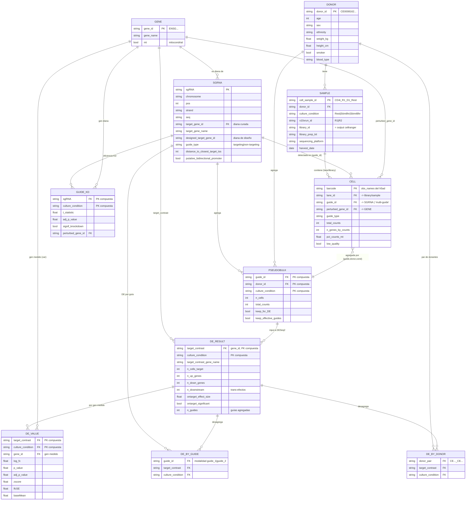

# Modelo de datos — Genome-scale CD4+ T cell Perturb-seq (Marson 2025)

El dataset es un **esquema en estrella** cuyo eje es la tripleta
**(guía sgRNA → gen perturbado) × condición de cultivo × donante**.
La expresión se agrega en cascada: **célula → pseudobulk → estadísticos de DE**.

## Diagrama ER

## Entidades y su origen físico

| Entidad | Archivo(s) | Grano (1 fila =) |
|---|---|---|
| **DONOR** | `sample_metadata.suppl_table.csv` (desnormalizado) | un donante (4) |
| **SAMPLE** | `sample_metadata.suppl_table.csv` | donante × condición × run (11) |
| **GENE** | `.var` de cualquier h5ad (referencia) | un gen medido (~18k–36k) |
| **SGRNA** | `sgrna_library_metadata.suppl_table.csv` | una guía (31.109) |
| **CELL** | `D*_*.assigned_guide.h5ad` `.obs` | una célula |
| **PSEUDOBULK** | `GWCD4i.pseudobulk_merged.h5ad` `.obs` | guía × donante × condición |
| **DE_RESULT** | `GWCD4i.DE_stats.h5ad` `.obs` / `DE_stats.suppl_table.csv` | gen perturbado × condición (33.983) |
| **DE_VALUE** | `GWCD4i.DE_stats.h5ad` `.layers` | (perturbación×condición) × gen medido |
| **DE_BY_GUIDE** | `GWCD4i.DE_stats.by_guide.h5mu` | guía × condición |
| **DE_BY_DONOR** | `GWCD4i.DE_stats.by_donors.h5mu` | par-de-donantes × perturbación × condición |
| **GUIDE_KD** | `guide_kd_efficiency.suppl_table.csv` | guía × condición |

## Claves y joins principales

- **Gen** es la entidad de referencia central (`gene_id` = Ensembl `ENSG…`, `gene_name` = símbolo).
  Aparece en dos roles: *gen perturbado* (diana de la guía) y *gen medido* (columna de la matriz de expresión / `.var`).
- **SGRNA.target_gene_id → GENE.gene_id**: cada guía apunta a un gen (ojo: `designed_target_gene_id`
  puede diferir de `target_gene_id` por curación post-hoc; hay ~1–2 guías por gen).
- **CELL.guide_id → SGRNA.sgRNA** (valor especial `multi-guide` si se detectó más de una guía).
  **CELL.lane_id → SAMPLE** (una lane 10x = un output de cellranger = una library).
- **PSEUDOBULK** = agregación de CELL por la clave compuesta `(guide_id, donor_id, culture_condition)`.
- **DE_RESULT** = agregación por `(target_contrast = gene_id, culture_condition)`; junta las `n_guides` guías del gen.
  `DE_stats.suppl_table.csv` es exactamente el `.obs` de este objeto en forma tabular.
- **DE_VALUE** (en `.layers`: `log_fc`, `zscore`, `adj_p_value`, …) es la relación N:N entre
  **DE_RESULT** (obs) y **GENE** (var): para cada perturbación×condición, un vector sobre los genes medidos.
- **DE_BY_GUIDE** y **DE_BY_DONOR** son la misma estructura que DE_RESULT pero desagregada
  (por guía individual, o por par de donantes) — sirven para métricas de reproducibilidad
  (`guide_correlation_*`, `donor_correlation_*`) que viven en `DE_RESULT.obs`.

### Nota sobre IDs de donante
Las etiquetas cortas `D1..D4` (nombres de archivo cell-level) se resuelven al `donor_id`
canónico `CE…` vía `sample_metadata` (`cell_sample_id` codifica `run_D#_condición`).
Las modalidades de `DE_stats.by_donors.h5mu` usan los IDs `CE…` unidos por `_`.
