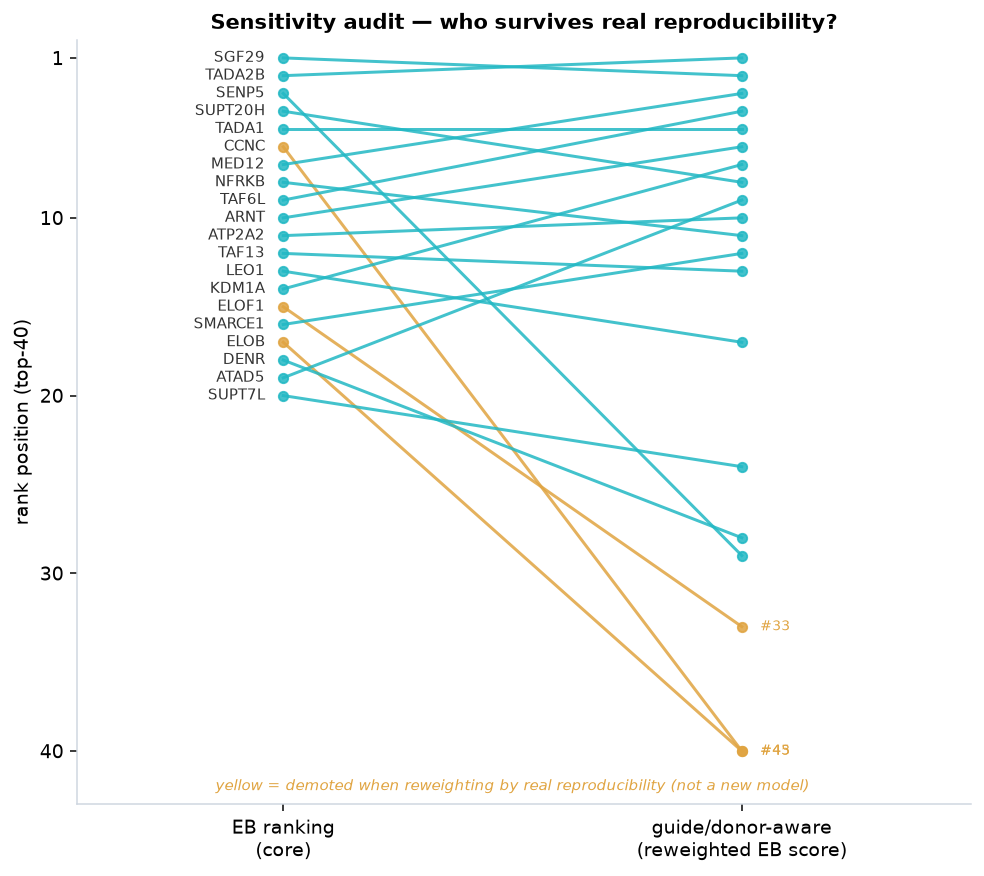
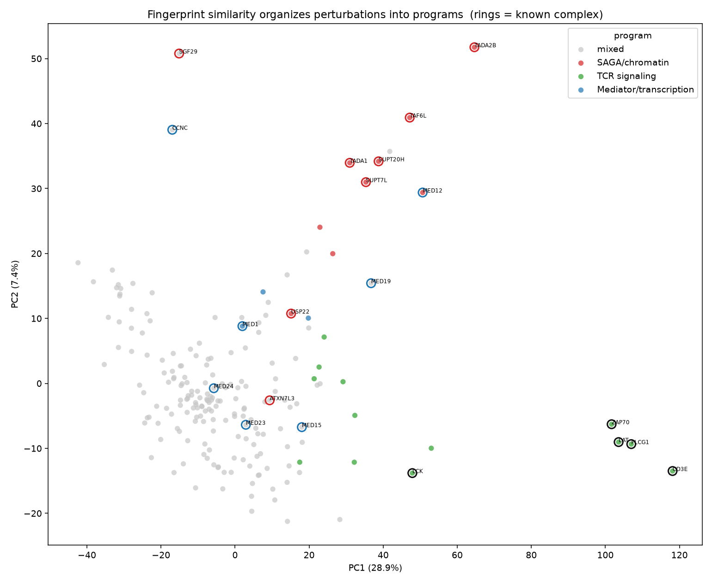
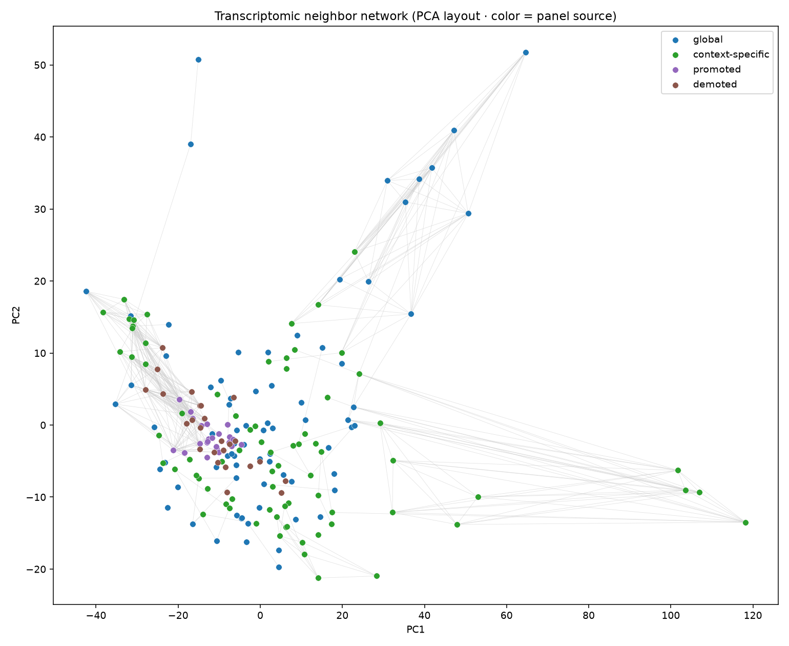
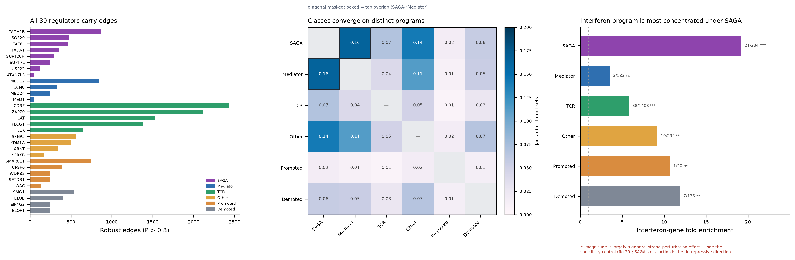
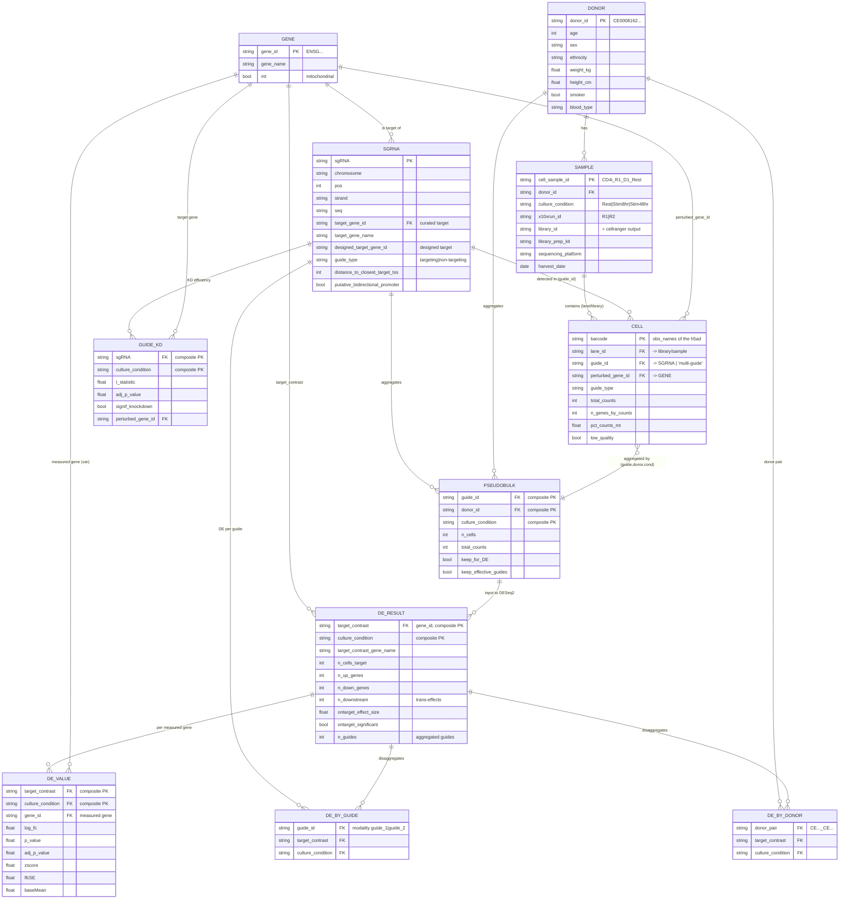

# Report — Genome-scale CD4+ T cell Perturb-seq

*Consolidated report for review. Reproducible with `make all` (local CSVs only).*


## Question

Which genes are **robust regulators** of CD4+ T cell programs — separating real
signal from noise and prioritizing by a **large and reproducible** effect, not by raw counts?

## Executive summary

- Perturbation effects are **heavy-tailed**: median 2 DEGs, but 1.5% are hubs
  with >1000. Summarize with percentiles and rankings, not the mean.
- **Effective knockdown gates the signal**: contrasts with a significant on-target KD (62%)
  concentrate **85%** of all trans-effects.
- An **empirical-Bayes** (pseudo-Bayesian) model ranks regulators by their latent regulatory
  power with uncertainty. The robust top is **chromatin/transcription** machinery
  (SAGA complex, Mediator, KDM1A, SETD2) — a large **and** stable effect across conditions.
- **Fingerprint similarity organizes the top perturbations into recognizable programs** — recovering
  TCR signaling, SAGA/chromatin and Mediator/transcription (permutation z=11/9/3) and surfacing
  candidate neighbors (e.g. the chromatin remodeler CHD7 assigned to the chromatin program by
  fingerprint, not by complex membership). Same honesty, different object: not just *who* is strong,
  but *what program* each perturbation resembles and *who resembles whom*.

We also built an **uncertainty-aware effect network** (bonus, Model 1) with **2,470 robust edges** (`P(|effect|>1.5×)>0.8` — the probability that the *magnitude* exceeds 1.5×, not that a causal edge exists) from 6 regulators in `docs/tables/robust_edges.csv`. It was assessed as a **proof-of-concept** (see `docs/EDGE_ANALYSIS.md`): coherent and biologically sensible, but of minimal coverage — kept as a bonus, not a strong result.

## Top regulators (for review)

| rank | gene | condition | regpower_eb_mean | p_top_1pct | observed_n_downstream | interpretation_note |
| --- | --- | --- | --- | --- | --- | --- |
| 1 | SGF29 | Stim48hr | 2.5012 | 0.8236 | 4868 | KD sig 3/3 cond; cross-cond repro 0.71; no off-target |
| 2 | TADA2B | Stim8hr | 2.446 | 0.8071 | 5919 | KD sig 3/3 cond; cross-cond repro 0.79; possible off-target |
| 3 | SENP5 | Stim8hr | 2.4291 | 0.8019 | 5171 | KD sig 3/3 cond; cross-cond repro 0.54; no off-target |
| 4 | SUPT20H | Stim8hr | 2.3911 | 0.7899 | 3947 | KD sig 3/3 cond; cross-cond repro 0.78; no off-target |
| 5 | TADA1 | Stim8hr | 2.3527 | 0.7773 | 3648 | KD sig 3/3 cond; cross-cond repro 0.81; no off-target |
| 6 | CCNC | Stim48hr | 2.2948 | 0.7576 | 4090 | KD sig 3/3 cond; cross-cond repro 0.56; no off-target |
| 7 | MED12 | Stim8hr | 2.2839 | 0.7538 | 4141 | KD sig 3/3 cond; cross-cond repro 0.49; no off-target |
| 8 | NFRKB | Rest | 2.265 | 0.747 | 3019 | KD sig 3/3 cond; cross-cond repro 0.83; no off-target |
| 9 | TAF6L | Stim8hr | 2.2397 | 0.7379 | 4638 | KD sig 3/3 cond; cross-cond repro 0.73; possible off-target |
| 10 | ARNT | Stim48hr | 2.2236 | 0.7321 | 2946 | KD sig 3/3 cond; cross-cond repro 0.79; no off-target |
| 11 | ATP2A2 | Rest | 2.2224 | 0.7316 | 3518 | KD sig 3/3 cond; cross-cond repro 0.45; no off-target |
| 12 | TAF13 | Stim8hr | 2.1897 | 0.7194 | 3341 | KD sig 3/3 cond; cross-cond repro 0.63; no off-target |
| 13 | LEO1 | Rest | 2.1758 | 0.7142 | 3014 | KD sig 3/3 cond; cross-cond repro 0.59; no off-target |
| 14 | KDM1A | Stim48hr | 2.1629 | 0.7093 | 2912 | KD sig 3/3 cond; cross-cond repro 0.69; no off-target |
| 15 | ELOF1 | Stim48hr | 2.1495 | 0.7041 | 4257 | KD sig 3/3 cond; cross-cond repro 0.78; possible off-target |

Full table (30, with all columns): `docs/tables/top_regulators_for_review.csv`.


## Naive hubs vs. quality-aware regulators

Ranking by raw `n_downstream` rewards hubs that don't survive the quality controls.
Of the top 30 raw hubs: **2 drop at the KD gate** (no validated on-target knockdown)
and **15 are demoted by EB shrinkage** for being condition-specific (the signal lives in
a single condition). The EB ranking surfaces regulators with a large **and** stable effect.


Stability was audited with a bootstrap (B=200) over the eligible rows: how often each gene falls
in the top-30 (`stability_frequency`) is in `top_regulators_for_review.csv`. The ranking is
moderately stable — best read as a *set* of robust regulators, not an exact ordering.


## Global vs. context-specific regulators

Splitting by `condition_specificity = max/sum of n_downstream` across conditions with significant KD:

- **Global** (stable effect in ≥2 conditions): SGF29, TADA2B, SENP5, SUPT20H, TADA1, CCNC… — chromatin/transcription machinery.
- **Context-specific** (effect concentrated in one condition): NCKAP1L, DOP1B, POGLUT3, ZAP70, TFAM, LCK… — includes TCR signaling
  (ZAP70, LCK), active only under stimulation.

Both classes are real biology; the distinction avoids confusing a universal regulator with a
context-dependent one. Tables: `top_global_regulators.csv`, `top_condition_specific_regulators.csv`.


## Sensitivity audit: does the ranking survive real (guide/donor) reproducibility?

The core ranking's caveat was using `xcond_reproducibility` (a cross-condition proxy). We audit it with
**real** reproducibility from the `.obs` of `DE_stats.h5ad` (`scripts/extract_de_obs_metadata.py`, `.obs`
only, ~4 s, no `.layers`): `guide_correlation_all` (agreement between the 2 guides) and
`donor_correlation_hits_mean` (cross-donor agreement), plus a penalty for single-guide targets.

**We do not re-estimate the EB posterior and it is not a new model**: we reweight the EB score
(`reweighted_score = regpower_eb_mean · repro_weight`) as a **sensitivity analysis** — which
regulators survive. In practice it is more **guide-aware** than **donor-aware**: `guide_corr` covers
78% of contrasts but `donor_corr` only **19%**
(the KD-gated subset of this summary-table audit; the dedicated per-donor object `by_donors.h5mu`
later gave **100%** cross-donor coverage — see `DONOR_ROBUSTNESS.md`); where it's missing, a
**neutral weight** is used (no penalty for absent data). Of the top-30 EB, **5 are demoted** and **5 are promoted**:

| gene | old_rank | new_rank | status | guide_corr | donor_corr | reason |
| --- | --- | --- | --- | --- | --- | --- |
| CCNC | 6 | 45 | demoted | 0.185 | 0.582 | demoted: low cross-guide correlation |
| ELOF1 | 15 | 33 | demoted | 0.283 | 0.687 | demoted: low cross-guide correlation |
| ELOB | 17 | 43 | demoted | 0.242 | 0.643 | demoted: low cross-guide correlation |
| EIF4G2 | 23 | 31 | demoted | 0.313 | 0.71 | demoted: lower reproducibility than its peers |
| SMG1 | 24 | 288 | demoted | 0.053 | 0.445 | demoted: single-guide (no cross-guide check) |
| CPSF6 | 31 | 16 | promoted | nan | 0.766 | promoted: high guide/donor reproducibility (undervalued by the core) |
| WAC | 35 | 25 | promoted | 0.363 | 0.816 | promoted: high guide/donor reproducibility (undervalued by the core) |
| SETDB1 | 37 | 14 | promoted | 0.573 | 0.878 | promoted: high guide/donor reproducibility (undervalued by the core) |
| WDR82 | 38 | 22 | promoted | 0.426 | 0.849 | promoted: high guide/donor reproducibility (undervalued by the core) |
| MED24 | 49 | 30 | promoted | 0.42 | 0.829 | promoted: high guide/donor reproducibility (undervalued by the core) |

- **Survivors** (large effect + reproducible): TADA2B, SGF29, MED12, TAF6L, TADA1… — SAGA + Mediator.

  > **Cis-off-target caveat (see [OPERATOR_ANALYSIS.md](OPERATOR_ANALYSIS.md#cis-off-target-gate-audit-step-1-insurance) · `offtarget_gate_sensitivity.csv`).** `offtarget_flag` is the *cis* flag (99.4% == neighbouring-gene KD). Under a hard cis exclusion the global ranking is stable (Spearman 0.99, 25/30 of the top-30), but three of the leading SAGA subunits were partly cis-inflated and fall — **TADA2B #2→#93, TAF6L #9→#130, SUPT7L #20→out** — while the cis-clean subunits **SUPT20H, TADA1, USP22** rise and anchor the program. The SAGA *identity* holds; the leading-subunit list is corrected. The ranking already covariate-adjusts, annotates, and penalises off-target (`off_i`, `any_offtarget`, `robust_score ×0.6`), so this affects a few named individuals, not the structure.



**The core ranking still works without this file** — the audit lives separately in
`hub_ranking_bayes_reproducibility_aware.csv` / `reproducibility_audit.csv`.


## Transcriptional programs

A rank is one number; a **fingerprint** — a regulator's downstream effect vector — is what the
perturbation actually does to the cell. On a balanced panel of 200 top perturbations we match each
regulator's fingerprint to the curated **SAGA / Mediator / TCR** complexes (nearest-centroid in the
same space as the validated cosine similarity). These are **candidate program assignments by
fingerprint similarity — not claims of physical complex membership.** The classifier is conservative:
only **25 of 200** perturbations are assigned a program (**4 flagged donor-fragile**: TCR signaling 3; Mediator/transcription 1);
the rest remain *mixed*, by design.

- **Fingerprint similarity recovers the known complexes** (permutation test, N=5000): SAGA z=9.37→11.07 (cross→within-condition) · Mediator z=3.16→3.96 (cross→within-condition) · TCR z=11.17→11.24 (cross→within-condition). The
  latent PC1 is program *identity*, not effect magnitude (|PC1| vs. n_downstream Spearman = 0.249).
- **25 assigned** (4 donor-fragile — TCR signaling 3; Mediator/transcription 1): TCR signaling (13), SAGA/chromatin (9), Mediator/transcription (3). Each program recovers its
  curated core and adds **newly assigned neighbors** (non-curated genes placed in the same fingerprint
  neighborhood) — e.g. the chromatin remodeler **CHD7** is assigned to the SAGA/chromatin program (a
  related perturbation response, not complex membership) and is **donor-robust**; the donor check flags
  ATF7IP2/NCAPG2/EIF1AX (TCR) and GLIPR2 (Mediator) as fingerprint artifacts that do not replicate
  across donors (see `donor_fragile_neighbors` in `program_label_evidence.csv`).

| program_label | n_regulators | n_known_complex_members | assigned_neighbors | mean_centroid_cosine | top_marker_genes |
| --- | --- | --- | --- | --- | --- |
| SAGA/chromatin | 9 | 6 | CHD7;TSPYL5 | 0.812 | ADA2+;PJA2+;TADA3+;MUC1+;MIEN1+;SELENOH+;NUCB2+;BST2+ |
| Mediator/transcription | 3 | 1 | POGLUT3;GLIPR2 | 0.592 | ADA2+;CD109+;BRD2+;MYL12A+;KIF13B+;DYNLT1+;BCAP29+;ABRACL+ |
| TCR signaling | 13 | 5 | ATF7IP2;NCAPG2;CLCC1;EIF1AX;PGGT1B;FZD6;UBE2E2;EFR3A | 0.768 | STK17B+;S100A11+;RNF19B+;SELPLG+;MYO1F+;BIN2+;CD53+;GPSM3+ |




**Do the reproducibility-promoted hits form coherent programs?** They have neighborhoods as tight as
the top global regulators (mean kNN cosine: promoted 0.469, demoted 0.459 vs.
global 0.395), so they are **not statistical noise** — yet they map onto *none* of the
canonical complexes. Read as: the audit surfaces a **distinct high-confidence set** rather than simply
rediscovering the known complexes.

*Scope: fingerprint-based, program-level re-analysis anchored to known complexes — candidate
assignments and hypotheses, not de-novo pathway discovery or novel complex membership. "Response
genes" are consistently-moved downstream genes (relative to the panel), not baseline markers; PCA is a
view, not the proof. `make fingerprints` · detail in `docs/FINGERPRINT_ANALYSIS.md`.*


## Convergent programs by regulator class

Is "chromatin machinery recovers as top hubs" just the expected result of perturbing coactivators? A
**balanced 30-regulator panel** — chosen by *class*, not by rank — tests whether classes converge on
*distinct* downstream programs (`make class-programs`, fully offline).

- **Classes converge on distinct programs**: median off-diagonal Jaccard of per-class convergent-target
  sets ≈ **0.05** — classes barely share targets.
- **A convergent interferon module** answers the "SAGA is expected" critique: genes hit by ≥4 of the 6
  robust SAGA-family regulators form a **163-gene module**,
  **23.7× enriched for interferon-stimulated genes**
  (P≈7.5e-21), **all de-repressive** (knockdown raises ISGs).
- Interferon repression is **most concentrated under SAGA/chromatin (19.2× in the class panel)**.

| class | targets | ISGs | fold | p | frac_up_on_KD |
| --- | --- | --- | --- | --- | --- |
| SAGA/chromatin | 234 | 21 | 19.2× | 1.7e-22 | 0.985 |
| Demoted control | 126 | 7 | 11.9× | 1.7e-06 | 1.0 |
| Repro-promoted | 20 | 1 | 10.7× | 8.9e-02 | 0.394 |
| Other robust | 232 | 10 | 9.2× | 8.7e-08 | 0.967 |
| TCR (context-specific) | 1408 | 38 | 5.8× | 1.6e-24 | 1.0 |
| Mediator | 183 | 3 | 3.5× | 5.4e-02 | 0.956 |



*Candidate convergent-target programs (ISG-flagged), not causal pathways. Detail:
`docs/literature_positioning.md`; per-class target lists in the **Programs by class** UI tab.*

## EDA findings


---

## Appendix A — Data model

The dataset is a **star schema** whose axis is the triple
**(sgRNA guide → perturbed gene) × culture condition × donor**.
Expression is aggregated in a cascade: **cell → pseudobulk → DE statistics**.

## ER diagram



## Entities and their physical origin

| Entity | File(s) | Grain (1 row =) |
|---|---|---|
| **DONOR** | `sample_metadata.suppl_table.csv` (denormalized) | one donor (4) |
| **SAMPLE** | `sample_metadata.suppl_table.csv` | donor × condition × run (11) |
| **GENE** | `.var` of any h5ad (reference) | one measured gene (~18k–36k) |
| **SGRNA** | `sgrna_library_metadata.suppl_table.csv` | one guide (31,109) |
| **CELL** | `D*_*.assigned_guide.h5ad` `.obs` | one cell |
| **PSEUDOBULK** | `GWCD4i.pseudobulk_merged.h5ad` `.obs` | guide × donor × condition |
| **DE_RESULT** | `GWCD4i.DE_stats.h5ad` `.obs` / `DE_stats.suppl_table.csv` | perturbed gene × condition (33,983) |
| **DE_VALUE** | `GWCD4i.DE_stats.h5ad` `.layers` | (perturbation×condition) × measured gene |
| **DE_BY_GUIDE** | `GWCD4i.DE_stats.by_guide.h5mu` | guide × condition |
| **DE_BY_DONOR** | `GWCD4i.DE_stats.by_donors.h5mu` | donor-pair × perturbation × condition |
| **GUIDE_KD** | `guide_kd_efficiency.suppl_table.csv` | guide × condition |

## Keys and main joins

- **Gene** is the central reference entity (`gene_id` = Ensembl `ENSG…`, `gene_name` = symbol).
  It appears in two roles: *perturbed gene* (the guide's target) and *measured gene* (a column of the expression matrix / `.var`).
- **SGRNA.target_gene_id → GENE.gene_id**: each guide points to a gene (note: `designed_target_gene_id`
  may differ from `target_gene_id` due to post-hoc curation; there are ~1–2 guides per gene).
- **CELL.guide_id → SGRNA.sgRNA** (special value `multi-guide` if more than one guide was detected).
  **CELL.lane_id → SAMPLE** (one 10x lane = one cellranger output = one library).
- **PSEUDOBULK** = aggregation of CELL by the composite key `(guide_id, donor_id, culture_condition)`.
- **DE_RESULT** = aggregation by `(target_contrast = gene_id, culture_condition)`; it joins the gene's `n_guides` guides.
  `DE_stats.suppl_table.csv` is exactly the `.obs` of this object in tabular form.
- **DE_VALUE** (in `.layers`: `log_fc`, `zscore`, `adj_p_value`, …) is the N:N relation between
  **DE_RESULT** (obs) and **GENE** (var): for each perturbation×condition, a vector over the measured genes.
- **DE_BY_GUIDE** and **DE_BY_DONOR** are the same structure as DE_RESULT but disaggregated
  (by individual guide, or by donor pair) — they feed the reproducibility metrics
  (`guide_correlation_*`, `donor_correlation_*`) that live in `DE_RESULT.obs`.

### Note on donor IDs
The short labels `D1..D4` (cell-level file names) resolve to the canonical `donor_id`
`CE…` via `sample_metadata` (`cell_sample_id` encodes `run_D#_condition`).
The modalities of `DE_stats.by_donors.h5mu` use the `CE…` IDs joined by `_`.

---

## Appendix B — EDA

## Scope

Analysis using only the **supplementary tables** (~15 MB). **No** `.h5ad`/`.h5mu` was loaded (1.8 TB).

| File | Rows | Use |
|---|---|---|
| `DE_stats.suppl_table.csv` | 33,983 | main table (the signal) |
| `sgrna_library_metadata.suppl_table.csv` | 26,504 | guide library |
| `sample_metadata.suppl_table.csv` | 12 | experimental design |

Reproducible: `python scripts/eda.py` → figures in `docs/figures/`, table in `docs/tables/`.

## Unit of analysis

**1 row = perturbed gene × culture condition** (`target_contrast` × `culture_condition`).
Rest / Stim8hr / Stim48hr.

## Key quality filters

| Filter | Available here | Source |
|---|---|---|
| `ontarget_significant` (effective KD, 10% FDR) | ✅ CSV | `DE_stats.suppl_table.csv` |
| `offtarget_flag` (possible off-target) | ✅ CSV | same |
| **cross-condition** reproducibility (proxy) | ✅ derivable | min/max of `n_downstream` across conditions |
| `single_guide_estimate` (2 concordant guides) | ❌ | `DE_stats.h5ad` `.obs` |
| `guide_correlation_all` (cross-guide) | ❌ | `DE_stats.h5ad` / `by_guide.h5mu` |
| `donor_correlation_hits_mean` (cross-donor) | ❌ | `DE_stats.h5ad` / `by_donors.h5mu` |

## Main findings

1. **DE effects are heavy-tailed.** Median **2 DEGs**, mean 60.5 (misleading), 15.4% with no effect,
   1.5% are hubs (>1000 DEGs). → summarize with **percentiles and rankings**, not the mean.
2. **Knockdown gates most of the signal.** 62% of contrasts have a significant on-target KD;
   these concentrate **85%** of all trans-effects. Filtering by `ontarget_significant` sharply raises
   signal density (not causal proof: a real KD may go undetected due to low baseline expression).
3. **Stimulated cells show broader effects.** Mean DEGs: Rest 53.1 · Stim8hr 68.9 · Stim48hr 59.4.
4. **Top hubs are plausible**, enriched in T cell signaling (CD3E/D/G, LAT, ZAP70, PLCG1,
   LCP2, VAV1) — suggesting the screen captures interpretable biological signal.
5. **The library covers ~2 guides/gene** (12,440 of 12,654 genes have exactly 2) → internal replication.
6. **Robust regulators ≠ raw hubs.** Requiring cross-condition stability + significant KD + no off-target
   surfaces **chromatin/transcription** regulators consistent across all 3 conditions (TADA2B, TADA1, SGF29,
   SUPT20H — SAGA complex; ELAVL1, NFRKB), distinct from the raw top dominated by Stim8hr-specific TCR signaling.

## Figures

`docs/figures/`
- `01_distribution_n_total_de_genes.png` — long tail
- `02_degs_by_condition.png`
- `03_top_hubs_by_condition.png`
- `04_ontarget_vs_downstream.png` — axis `kd_strength = −ontarget_effect_size`
- `05_guides_per_gene.png`
- `06_reproducibility_vs_effects.png` — cross-condition reproducibility vs. magnitude

## Actionable table

`docs/tables/top_robust_regulators.csv` (top 30). Score using **CSV columns only**:

```
robust_score = log1p(n_downstream)
             · ontarget_significant
             · (0.6 if offtarget_flag else 1.0)
             · (0.5 + 0.5 · cross_condition_reproducibility)
             · (n_signif_conditions / 3)
```

## Practical next steps

1. **Definitive robust ranking**: strengthen `robust_score` with `single_guide_estimate` +
   `donor_correlation_hits_mean` from `GWCD4i.DE_stats.h5ad` (17 GB).
2. **Gene-level downstream matrix**: load the `.layers` of `DE_stats.h5ad` (log_fc/zscore/padj)
   for the top regulators, already filtered.
3. **Per-condition regulatory graph**: build the regulator → downstream network per condition and
   compare Rest vs. Stim to identify context-specific regulators.

---

## Appendix C — Modeling

Two small, **dependency-light** models (only `scipy` + `statsmodels`) that separate signal
from noise with uncertainty instead of ranking by raw counts and `adj_p_value < 0.1`.

> **Honest naming:** both are **empirical-Bayes / pseudo-Bayesian**. There is no PPL,
> no formal random effects, no jointly MCMC-sampled posterior. Where we say
> "posterior" we mean the normal EB approximation with prior parameters estimated from the data.

---

## Model 2 — regulator ranking (core, runs locally)

**Script:** `scripts/model_hubs.py` · **Runs on:** `DE_stats.suppl_table.csv` (local, no downloads).
**Grain:** 1 row = perturbed gene × condition.

### Specification

1. **Fixed effects (conditional mean).** GLM on `n_downstream`:

   ```
   n_downstream ~ C(culture_condition) + ontarget_significant + offtarget_flag
   ```

   Poisson and NB share the same mean model; since we only use the fitted mean `μᵢ`
   (no inference on coefficients) we fit by stable IRLS: Poisson GLM → NB `α` by
   method of moments (`Var = μ + α·μ²`) → NB GLM with fixed `α`. This avoids the
   convergence problems of full NB MLE.

2. **Empirical-Bayes shrinkage of the per-gene effect.** Log-rate deviation from the baseline:

   ```
   workᵢ = log(yᵢ + 0.5) − log(μᵢ + 0.5)
   ```

   Per gene g:  `d_g = mean(work)`,  `s²_g = σ²_e / n_g`.
   Prior `u_g ~ Normal(0, τ²)` with `τ²` by method of moments (`Var(d_g) − mean(s²_g)`).
   Approximate posterior:

   ```
   u_g | data ~ Normal( shrink·d_g ,  shrink·s²_g ),   shrink = τ²/(τ²+s²_g)
   ```

   Genes with few conditions / little signal are shrunk toward 0.

### Outputs

`docs/tables/hub_ranking_bayes.csv` (all genes) and `docs/tables/top_regulators_for_review.csv`
(top 30, judge-facing). Key columns: `regpower_eb_mean/sd` (log-rate regulatory power),
`p_top_1pct` (EB probability of exceeding the empirical top-1% threshold, not "P of being in the top 1%"),
`expected_downstream`. Figure `07_hub_posterior_ranking.png`.

### Reading the result

The robust ranking surfaces **chromatin/transcription** machinery consistent across conditions
— SAGA complex (TADA1/TADA2B/SGF29/SUPT20H/TAF6L), Mediator (MED12/CCNC), KDM1A, SETD2, CTBP1 —
above the raw TCR-signaling hubs that were Stim8hr-specific. In other words: the shrinkage
rewards regulators with a large **and** stable effect.

### Caveats

- `xcond_reproducibility` is an **exploratory feature** (cross-condition stability). It does **not**
  replace cross-donor / cross-guide reproducibility, which requires `DE_stats.h5ad`.
- The fixed-effects baseline is treated as known (plug-in) → pseudo-Bayesian, not full Bayes.
- `single_guide_estimate` and `n_guides` are NOT in the CSV; in the core review table they appear as
  `NA (requires DE_stats.h5ad)` — they are present in the sensitivity audit below.

### Guide/donor-aware sensitivity audit (optional)

When `de_obs_reproducibility_metadata.csv` exists (extracted from the `.obs` of `DE_stats.h5ad`,
without `.layers`), `model_hubs.py` runs an audit: it **reweights** the EB score with real
reproducibility (`reweighted_score = regpower_eb_mean · repro_weight`) and reports which regulators
survive (`reproducibility_audit.csv`, fig 19).

- **It is a sensitivity analysis, not a new posterior**: the EB model is NOT re-estimated.
- **Partial coverage**: `guide_correlation_all` ~78% of contrasts, `donor_correlation_hits_mean`
  only ~19% (the KD-gated subset of this summary-table audit) → in practice more *guide-aware* than
  *donor-aware*. Where the metric is missing, a **neutral weight** (0.75) is used, so **a gene is not
  penalized just for lacking donor metadata**. The dedicated per-donor object (`by_donors.h5mu`,
  Tier 1) later gave **100%** cross-donor coverage — see `DONOR_ROBUSTNESS.md`.
- The **core** ranking does **not depend** on this file (`make all` runs without it).

---

## Model 1 — uncertainty-aware effect network (optional bonus)

**Scripts:** `scripts/model_edges_spike.py` (validation) and `scripts/model_edges.py` (scaling).
**Note:** a bonus — if the remote spike fails or is slow, the core deliverable (ranking + audits +
programs) is unaffected.

### Idea

Exact normal-normal EB on `log_fc` / `lfcSE` from the h5ad `.layers`:

```
yᵢ | θᵢ ~ Normal(θᵢ, seᵢ²)          # observed
θᵢ     ~ Normal(0, τ²)              # shrinkage prior
θᵢ|yᵢ  ~ Normal(mᵢ, vᵢ),  vᵢ = 1/(1/τ² + 1/seᵢ²),  mᵢ = vᵢ·yᵢ/seᵢ²
```

Per-edge outputs: `theta_post_mean/sd`, `p_effect_positive`, `p_abs_effect_gt_1p5x`.
**Decision rule** (more interpretable than FDR): `p_abs_effect_gt_1p5x > 0.8 AND ontarget_significant`.

### Memory/compute-aware strategy

Disk: **9.8 GB free < 17 GB** for the h5ad → not downloaded. Instead:
- Only the edges of the **candidate regulators** (top of Model 2) are needed, not the ~350M.
- `model_edges_spike.py` **measures** (does not assume) the layout/chunking and the real cost of
  reading one row per slice from S3 (anonymous `fsspec` + `h5py`). If viable, `model_edges.py`
  fetches only those rows and runs the vectorized EB (seconds, ~15 MB RAM).
- `τ²` is estimated from a sample of rows, not the whole matrix (documented approximation).

See the real spike verdict in `docs/report.md` (Model 1 section).

---

## How to run

```bash
make model          # Model 2 (core)
make spike          # Model 1 spike (optional, requires: pip install h5py s3fs fsspec)
```

## Next steps (not included)

- Strengthen `regpower` with real cross-donor/cross-guide reproducibility from `DE_stats.h5ad`.
- A condition-specific term `γ_{p,c,g}` and a spike-and-slab prior (`z ~ Bernoulli(π)`) for the network.
- Full Bayes (NumPyro/PyMC) if EB stops being sufficient.
