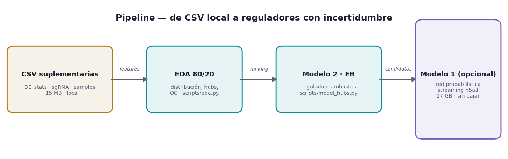
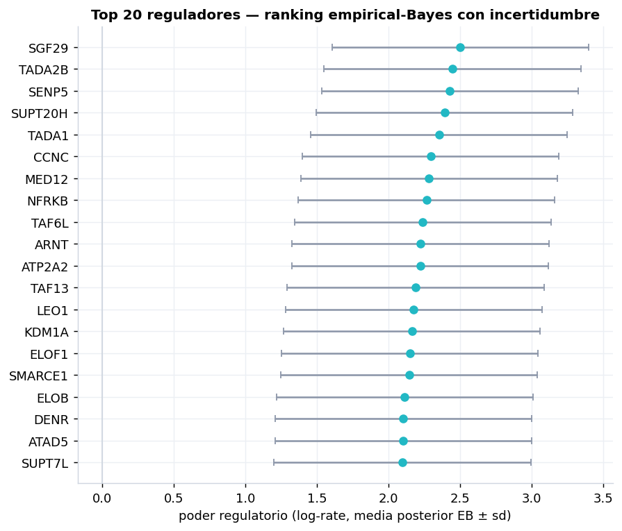
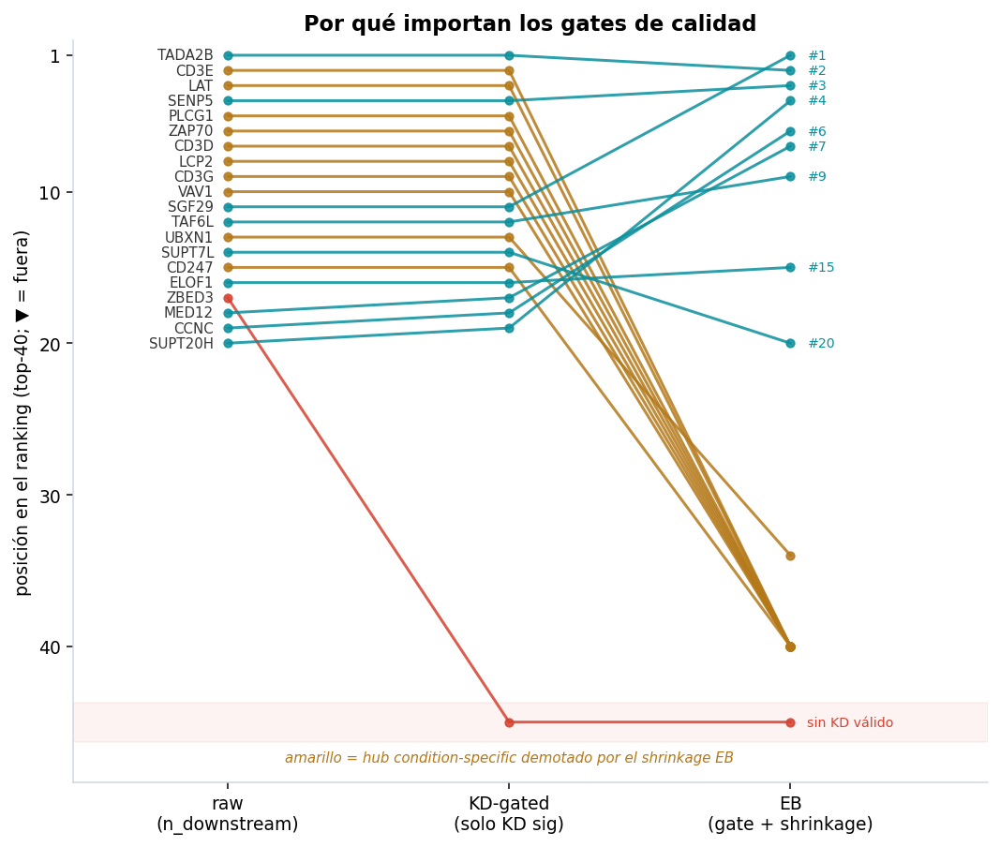
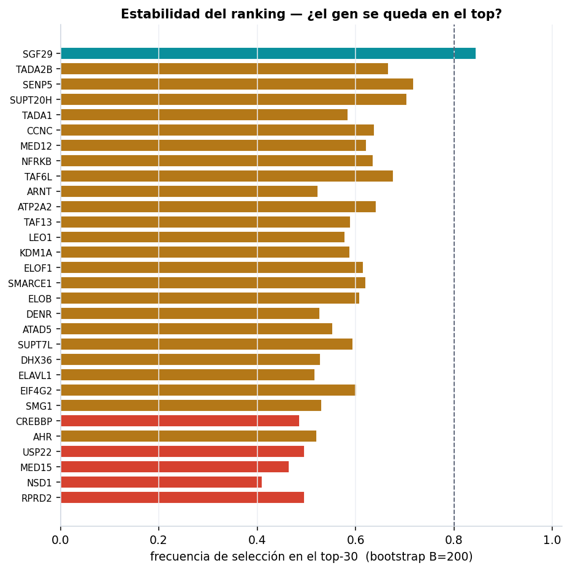
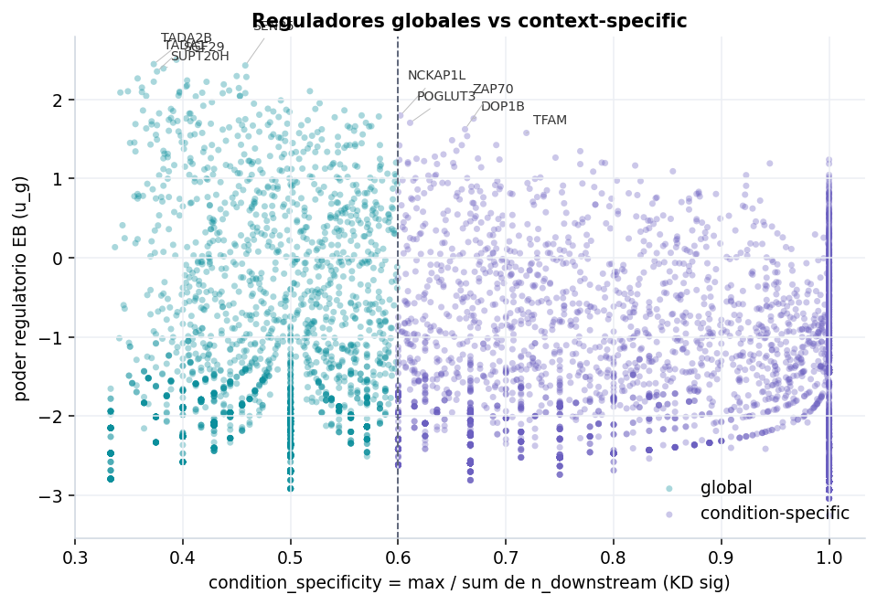
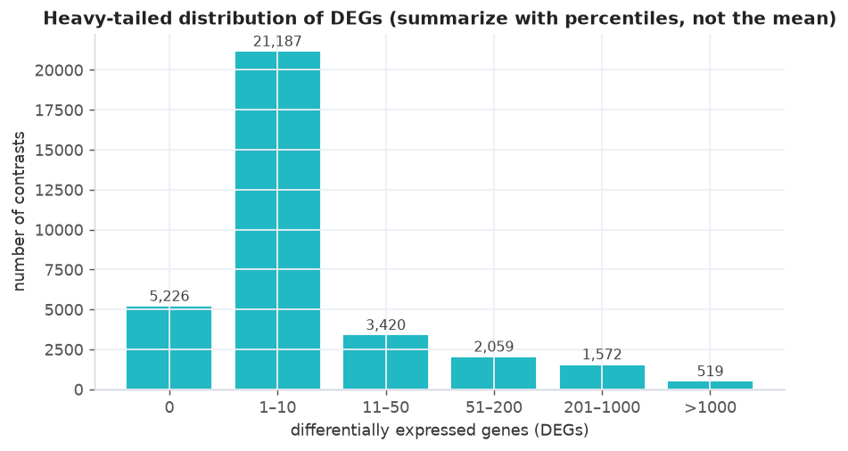
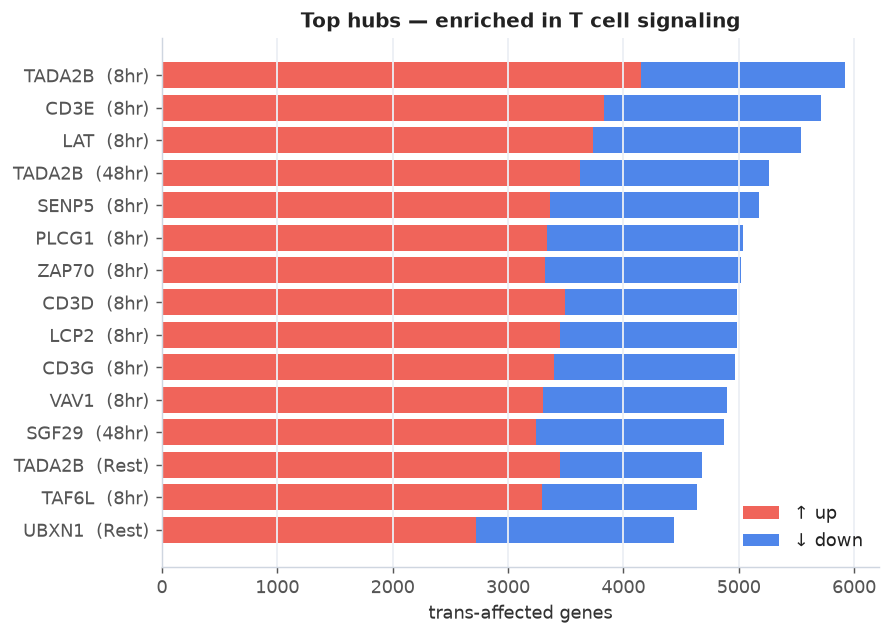
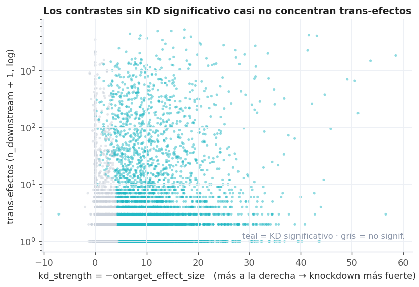
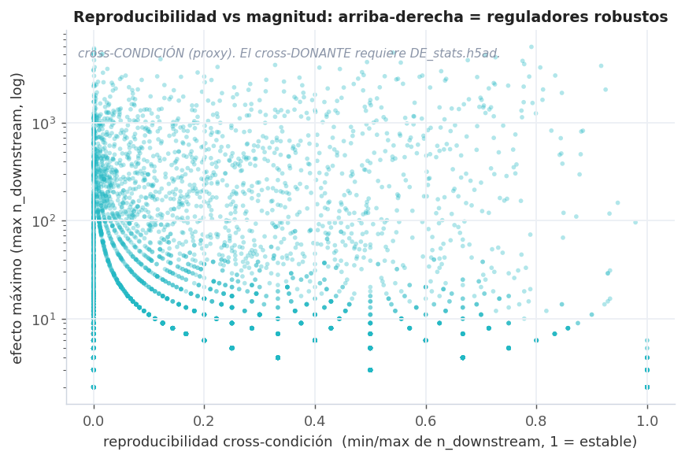
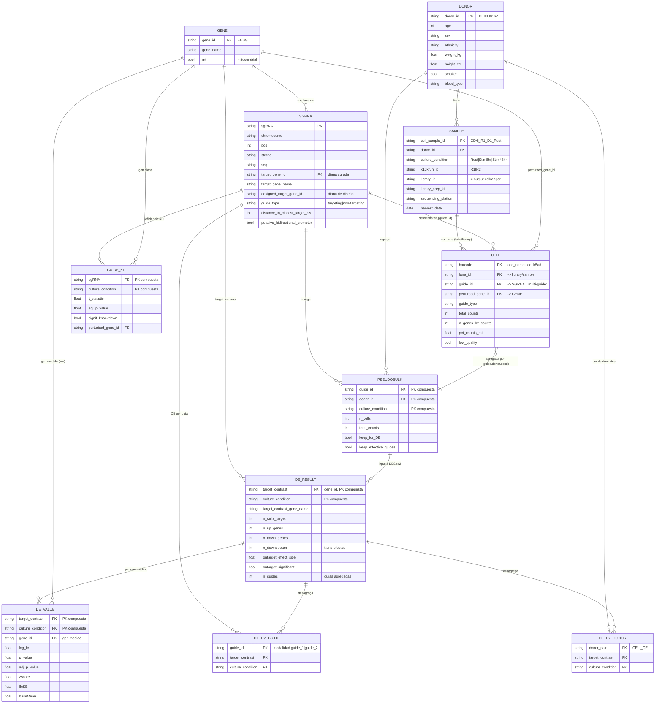

# Reporte — Genome-scale CD4+ T cell Perturb-seq

*Reporte consolidado para revisión. Reproducible con `make all` (solo CSV locales).*



## Pregunta

¿Qué genes son **reguladores robustos** de los programas de células T CD4+, separando
señal real de ruido y priorizando por efecto **grande y reproducible**, no por conteos crudos?

## Resumen ejecutivo

- El efecto de las perturbaciones es **heavy-tailed**: mediana 2 DEGs, pero un 1.5% son hubs
  con >1000. Se resume con percentiles y rankings, no con la media.
- El **knockdown efectivo gatea la señal**: los contrastes con KD on-target significativo (62%)
  concentran el **85%** de todos los trans-efectos.
- Un modelo **empirical-Bayes** (pseudo-bayesiano) rankea reguladores por poder regulatorio
  latente con incertidumbre. El top robusto es maquinaria de **cromatina/transcripción**
  (complejo SAGA, Mediador, KDM1A, SETD2) — efecto grande **y** estable entre condiciones.

Se generó además una **red probabilística de edges** (bonus, Modelo 1) con **2,470 edges robustos** (`P(|efecto|>1.5×)>0.8`) en `docs/tables/robust_edges.csv`.

## Top reguladores (para revisión)

| rank | gene | condition | regpower_eb_mean | p_top_1pct | observed_n_downstream | interpretation_note |
| --- | --- | --- | --- | --- | --- | --- |
| 1 | SGF29 | Stim48hr | 2.5012 | 0.8236 | 4868 | KD sig 3/3 cond; repro cross-cond 0.71; sin off-target |
| 2 | TADA2B | Stim8hr | 2.446 | 0.8071 | 5919 | KD sig 3/3 cond; repro cross-cond 0.79; posible off-target |
| 3 | SENP5 | Stim8hr | 2.4291 | 0.8019 | 5171 | KD sig 3/3 cond; repro cross-cond 0.54; sin off-target |
| 4 | SUPT20H | Stim8hr | 2.3911 | 0.7899 | 3947 | KD sig 3/3 cond; repro cross-cond 0.78; sin off-target |
| 5 | TADA1 | Stim8hr | 2.3527 | 0.7773 | 3648 | KD sig 3/3 cond; repro cross-cond 0.81; sin off-target |
| 6 | CCNC | Stim48hr | 2.2948 | 0.7576 | 4090 | KD sig 3/3 cond; repro cross-cond 0.56; sin off-target |
| 7 | MED12 | Stim8hr | 2.2839 | 0.7538 | 4141 | KD sig 3/3 cond; repro cross-cond 0.49; sin off-target |
| 8 | NFRKB | Rest | 2.265 | 0.747 | 3019 | KD sig 3/3 cond; repro cross-cond 0.83; sin off-target |
| 9 | TAF6L | Stim8hr | 2.2397 | 0.7379 | 4638 | KD sig 3/3 cond; repro cross-cond 0.73; posible off-target |
| 10 | ARNT | Stim48hr | 2.2236 | 0.7321 | 2946 | KD sig 3/3 cond; repro cross-cond 0.79; sin off-target |
| 11 | ATP2A2 | Rest | 2.2224 | 0.7316 | 3518 | KD sig 3/3 cond; repro cross-cond 0.45; sin off-target |
| 12 | TAF13 | Stim8hr | 2.1897 | 0.7194 | 3341 | KD sig 3/3 cond; repro cross-cond 0.63; sin off-target |
| 13 | LEO1 | Rest | 2.1758 | 0.7142 | 3014 | KD sig 3/3 cond; repro cross-cond 0.59; sin off-target |
| 14 | KDM1A | Stim48hr | 2.1629 | 0.7093 | 2912 | KD sig 3/3 cond; repro cross-cond 0.69; sin off-target |
| 15 | ELOF1 | Stim48hr | 2.1495 | 0.7041 | 4257 | KD sig 3/3 cond; repro cross-cond 0.78; posible off-target |

Tabla completa (30, con todas las columnas): `docs/tables/top_regulators_for_review.csv`.



## Naive hubs vs quality-aware regulators

Rankear por `n_downstream` crudo premia hubs que no sobreviven a los controles de calidad.
De los 30 hubs crudos top: **2 caen por el gate de KD** (sin knockdown on-target validado)
y **15 se demotan por el shrinkage EB** por ser condition-specific (la señal vive en
una sola condición). El ranking EB surface reguladores con efecto grande **y** estable.



La estabilidad se auditó con bootstrap (B=200) sobre las filas elegibles: la frecuencia con que
cada gen cae en el top-30 (`stability_frequency`) está en `top_regulators_for_review.csv`. El
ranking es moderadamente estable — conviene leerlo como *conjunto* de reguladores robustos, no
como un orden exacto.



## Global versus context-specific regulators

Separando por `condition_specificity = max/sum de n_downstream` entre condiciones con KD significativo:

- **Globales** (efecto estable en ≥2 condiciones): SGF29, TADA2B, SENP5, SUPT20H, TADA1, CCNC… — maquinaria de cromatina/transcripción.
- **Context-specific** (efecto concentrado en una condición): NCKAP1L, DOP1B, POGLUT3, ZAP70, TFAM, LCK… — incluye señalización TCR
  (ZAP70, LCK), activa solo bajo estímulo.

Ambas clases son biología real; la distinción evita confundir un regulador universal con uno de contexto.
Tablas: `top_global_regulators.csv`, `top_condition_specific_regulators.csv`.



## Hallazgos del EDA






---

## Anexo A — Modelo de datos

El dataset es un **esquema en estrella** cuyo eje es la tripleta
**(guía sgRNA → gen perturbado) × condición de cultivo × donante**.
La expresión se agrega en cascada: **célula → pseudobulk → estadísticos de DE**.

## Diagrama ER



## Entidades y su origen físico

| Entidad | Archivo(s) | Grano (1 fila =) |
|---|---|---|
| **DONOR** | `sample_metadata.suppl_table.csv` (desnormalizado) | un donante (4) |
| **SAMPLE** | `sample_metadata.suppl_table.csv` | donante × condición × run (11) |
| **GENE** | `.var` de cualquier h5ad (referencia) | un gen medido (~18k–36k) |
| **SGRNA** | `sgrna_library_metadata.suppl_table.csv` | una guía (31.109) |
| **CELL** | `D*_*.assigned_guide.h5ad` `.obs` | una célula |
| **PSEUDOBULK** | `GWCD4i.pseudobulk_merged.h5ad` `.obs` | guía × donante × condición |
| **DE_RESULT** | `GWCD4i.DE_stats.h5ad` `.obs` / `DE_stats.suppl_table.csv` | gen perturbado × condición (33.983) |
| **DE_VALUE** | `GWCD4i.DE_stats.h5ad` `.layers` | (perturbación×condición) × gen medido |
| **DE_BY_GUIDE** | `GWCD4i.DE_stats.by_guide.h5mu` | guía × condición |
| **DE_BY_DONOR** | `GWCD4i.DE_stats.by_donors.h5mu` | par-de-donantes × perturbación × condición |
| **GUIDE_KD** | `guide_kd_efficiency.suppl_table.csv` | guía × condición |

## Claves y joins principales

- **Gen** es la entidad de referencia central (`gene_id` = Ensembl `ENSG…`, `gene_name` = símbolo).
  Aparece en dos roles: *gen perturbado* (diana de la guía) y *gen medido* (columna de la matriz de expresión / `.var`).
- **SGRNA.target_gene_id → GENE.gene_id**: cada guía apunta a un gen (ojo: `designed_target_gene_id`
  puede diferir de `target_gene_id` por curación post-hoc; hay ~1–2 guías por gen).
- **CELL.guide_id → SGRNA.sgRNA** (valor especial `multi-guide` si se detectó más de una guía).
  **CELL.lane_id → SAMPLE** (una lane 10x = un output de cellranger = una library).
- **PSEUDOBULK** = agregación de CELL por la clave compuesta `(guide_id, donor_id, culture_condition)`.
- **DE_RESULT** = agregación por `(target_contrast = gene_id, culture_condition)`; junta las `n_guides` guías del gen.
  `DE_stats.suppl_table.csv` es exactamente el `.obs` de este objeto en forma tabular.
- **DE_VALUE** (en `.layers`: `log_fc`, `zscore`, `adj_p_value`, …) es la relación N:N entre
  **DE_RESULT** (obs) y **GENE** (var): para cada perturbación×condición, un vector sobre los genes medidos.
- **DE_BY_GUIDE** y **DE_BY_DONOR** son la misma estructura que DE_RESULT pero desagregada
  (por guía individual, o por par de donantes) — sirven para métricas de reproducibilidad
  (`guide_correlation_*`, `donor_correlation_*`) que viven en `DE_RESULT.obs`.

### Nota sobre IDs de donante
Las etiquetas cortas `D1..D4` (nombres de archivo cell-level) se resuelven al `donor_id`
canónico `CE…` vía `sample_metadata` (`cell_sample_id` codifica `run_D#_condición`).
Las modalidades de `DE_stats.by_donors.h5mu` usan los IDs `CE…` unidos por `_`.

---

## Anexo B — EDA

## Scope

Análisis con solo las **tablas suplementarias** (~15 MB). **No** se cargó ningún `.h5ad`/`.h5mu` (1.8 TB).

| Archivo | Filas | Uso |
|---|---|---|
| `DE_stats.suppl_table.csv` | 33,983 | tabla principal (la señal) |
| `sgrna_library_metadata.suppl_table.csv` | 26,504 | librería de guías |
| `sample_metadata.suppl_table.csv` | 12 | diseño experimental |

Regenerable: `python scripts/eda.py` → figuras en `docs/figures/`, tabla en `docs/tables/`.

## Unit of analysis

**1 fila = gen perturbado × condición de cultivo** (`target_contrast` × `culture_condition`).
Rest / Stim8hr / Stim48hr.

## Key quality filters

| Filtro | Disponible aquí | Fuente |
|---|---|---|
| `ontarget_significant` (KD efectivo, 10% FDR) | ✅ CSV | `DE_stats.suppl_table.csv` |
| `offtarget_flag` (posible off-target) | ✅ CSV | idem |
| reproducibilidad **cross-condición** (proxy) | ✅ derivable | min/max de `n_downstream` entre condiciones |
| `single_guide_estimate` (2 guías concordantes) | ❌ | `DE_stats.h5ad` `.obs` |
| `guide_correlation_all` (cross-guide) | ❌ | `DE_stats.h5ad` / `by_guide.h5mu` |
| `donor_correlation_hits_mean` (cross-donante) | ❌ | `DE_stats.h5ad` / `by_donors.h5mu` |

## Main findings

1. **Los efectos de DE son heavy-tailed.** Mediana **2 DEGs**, media 60.5 (engañosa), 15.4% sin efecto,
   1.5% son hubs (>1000 DEGs). → resume con **percentiles y rankings**, no media.
2. **El knockdown gatea la mayor parte de la señal.** 62% de contrastes con KD on-target significativo;
   estos concentran el **85%** de todos los trans-efectos. Filtrar por `ontarget_significant` sube mucho
   la densidad de señal (no es prueba causal: puede haber KD real no detectado por baja expresión basal).
3. **Las células estimuladas muestran efectos más amplios.** Media de DEGs: Rest 53.1 · Stim8hr 68.9 · Stim48hr 59.4.
4. **Los top hubs son plausibles**, enriquecidos en señalización de células T (CD3E/D/G, LAT, ZAP70, PLCG1,
   LCP2, VAV1) — sugiere que la pantalla captura señal biológica interpretable.
5. **La librería tiene cobertura ~2 guías/gen** (12,440 de 12,654 genes) → replicación interna.
6. **Reguladores robustos ≠ hubs crudos.** Al exigir estabilidad cross-condición + KD signif. + sin off-target,
   suben reguladores de **cromatina/transcripción** consistentes en las 3 condiciones (TADA2B, TADA1, SGF29,
   SUPT20H — complejo SAGA; ELAVL1, NFRKB), distintos del top crudo dominado por señalización TCR específica de Stim8hr.

## Figuras

`docs/figures/`
- `01_distribution_n_total_de_genes.png` — cola larga
- `02_degs_by_condition.png`
- `03_top_hubs_by_condition.png`
- `04_ontarget_vs_downstream.png` — eje `kd_strength = −ontarget_effect_size`
- `05_guides_per_gene.png`
- `06_reproducibility_vs_effects.png` — reproducibilidad cross-condición vs magnitud

## Tabla accionable

`docs/tables/top_robust_regulators.csv` (top 30). Score **solo con columnas del CSV**:

```
robust_score = log1p(n_downstream)
             · ontarget_significant
             · (0.6 si offtarget_flag else 1.0)
             · (0.5 + 0.5 · reproducibilidad_cross_condición)
             · (n_signif_conditions / 3)
```

## Practical next steps

1. **Ranking robusto definitivo**: reforzar `robust_score` con `single_guide_estimate` +
   `donor_correlation_hits_mean` desde `GWCD4i.DE_stats.h5ad` (17 GB).
2. **Matriz downstream a nivel de gen**: cargar los `.layers` de `DE_stats.h5ad` (log_fc/zscore/padj)
   para los reguladores top, ya filtrados.
3. **Grafo regulatorio por condición**: construir la red regulador → downstream por condición y
   comparar Rest vs Stim para identificar reguladores context-specific.

---

## Anexo C — Modelado

Dos modelos pequeños, **dependency-light** (solo `scipy` + `statsmodels`), que separan señal
de ruido con incertidumbre en vez de rankear por conteos crudos y `adj_p_value < 0.1`.

> **Nomenclatura honesta:** ambos son **empirical-Bayes / pseudo-bayesianos**. No hay PPL,
> ni random effects formales, ni posterior conjunto muestreado por MCMC. Donde decimos
> "posterior" es la aproximación normal del EB con parámetros de prior estimados de los datos.

---

## Modelo 2 — ranking de reguladores (core, corre local)

**Script:** `scripts/model_hubs.py` · **Corre con:** `DE_stats.suppl_table.csv` (local, sin descargas).
**Grano:** 1 fila = gen perturbado × condición.

### Especificación

1. **Efectos fijos (media condicional).** GLM sobre `n_downstream`:

   ```
   n_downstream ~ C(culture_condition) + ontarget_significant + offtarget_flag
   ```

   Poisson y NB comparten el mismo modelo de media; como solo usamos la media ajustada `μᵢ`
   (no inferencia sobre coeficientes) ajustamos por IRLS estable: Poisson GLM → `α` de NB por
   método de momentos (`Var = μ + α·μ²`) → NB GLM con `α` fijo. Evita los problemas de
   convergencia del NB por MLE completo.

2. **Shrinkage empirical-Bayes del efecto por gen.** Desviación log-rate respecto al baseline:

   ```
   workᵢ = log(yᵢ + 0.5) − log(μᵢ + 0.5)
   ```

   Por gen g:  `d_g = mean(work)`,  `s²_g = σ²_e / n_g`.
   Prior `u_g ~ Normal(0, τ²)` con `τ²` por método de momentos (`Var(d_g) − mean(s²_g)`).
   Posterior aproximado:

   ```
   u_g | datos ~ Normal( shrink·d_g ,  shrink·s²_g ),   shrink = τ²/(τ²+s²_g)
   ```

   Genes con pocas condiciones / poca señal se encogen hacia 0.

### Salidas

`docs/tables/hub_ranking_bayes.csv` (todos los genes) y `docs/tables/top_regulators_for_review.csv`
(top 30, judge-facing). Columnas clave: `regpower_eb_mean/sd` (poder regulatorio log-rate),
`p_top_1pct` (P de estar en el top 1%), `expected_downstream`. Figura `07_hub_posterior_ranking.png`.

### Lectura del resultado

El ranking robusto surface maquinaria de **cromatina/transcripción** consistente entre condiciones
—complejo SAGA (TADA1/TADA2B/SGF29/SUPT20H/TAF6L), Mediador (MED12/CCNC), KDM1A, SETD2, CTBP1—
por encima de los hubs de señalización TCR crudos que eran específicos de Stim8hr. Es decir: el
shrinkage premia a los reguladores con efecto grande **y** estable.

### Caveats

- `xcond_reproducibility` es una **feature exploratoria** (estabilidad cross-condición). **No**
  sustituye la reproducibilidad cross-donor / cross-guide, que requiere `DE_stats.h5ad`.
- El baseline de efectos fijos se trata como conocido (plug-in) → pseudo-bayesiano, no full-Bayes.
- `single_guide_estimate` y `n_guides` NO están en el CSV; en la tabla de review aparecen como
  `NA (requiere DE_stats.h5ad)`.

---

## Modelo 1 — red probabilística de edges (ESTRICTAMENTE OPCIONAL)

**Scripts:** `scripts/model_edges_spike.py` (validación) y `scripts/model_edges.py` (escalado).
**Regla:** si el spike remoto falla o es lento, el entregable oficial es el Modelo 2 + docs.

### Idea

EB normal-normal exacto sobre `log_fc` / `lfcSE` de los `.layers` del h5ad:

```
yᵢ | θᵢ ~ Normal(θᵢ, seᵢ²)          # observado
θᵢ     ~ Normal(0, τ²)              # prior con shrinkage
θᵢ|yᵢ  ~ Normal(mᵢ, vᵢ),  vᵢ = 1/(1/τ² + 1/seᵢ²),  mᵢ = vᵢ·yᵢ/seᵢ²
```

Salidas por edge: `theta_post_mean/sd`, `p_effect_positive`, `p_abs_effect_gt_1p5x`.
**Regla de decisión** (más interpretable que FDR): `p_abs_effect_gt_1p5x > 0.8 AND ontarget_significant`.

### Estrategia consciente de memoria/cómputo

Disco: **9.8 GB libres < 17 GB** del h5ad → no se descarga. En vez de eso:
- Solo se necesitan las edges de los **reguladores candidatos** (top del Modelo 2), no las ~350M.
- `model_edges_spike.py` **mide** (no asume) el layout/chunking y el coste real de leer una fila
  por slice desde S3 (`fsspec` anónimo + `h5py`). Si es viable, `model_edges.py` baja solo esas
  filas y corre el EB vectorizado (segundos, ~15 MB de RAM).
- `τ²` se estima de una muestra de filas, no de toda la matriz (aproximación documentada).

Ver el veredicto real del spike en `docs/report.md` (sección Modelo 1).

---

## Cómo correr

```bash
make model          # Modelo 2 (core)
make spike          # Modelo 1 spike (opcional, requiere: pip install h5py s3fs fsspec)
```

## Next steps (no incluidos)

- Reforzar `regpower` con reproducibilidad cross-donor/cross-guide real desde `DE_stats.h5ad`.
- Término condición-específico `γ_{p,c,g}` y prior spike-and-slab (`z ~ Bernoulli(π)`) para la red.
- Full-Bayes (NumPyro/PyMC) si el EB deja de ser suficiente.
